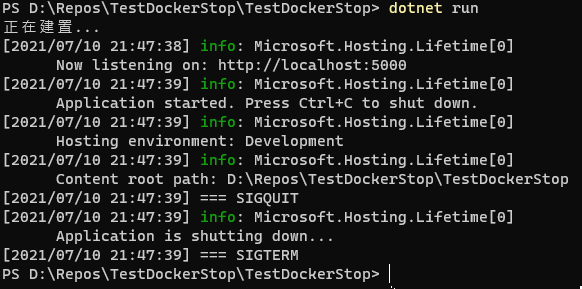
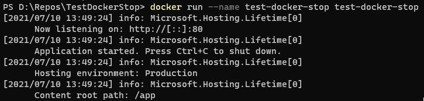
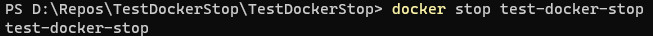
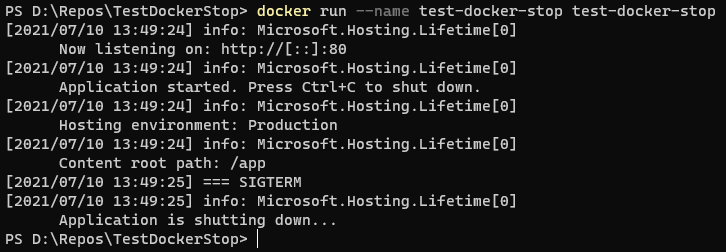

# ASP.NET Core 5 執行 Docker Stop 訊號測試


Program.cs 的程式碼，參考 [當 .NET Core 執行在 Linux 或 Docker 容器中如何優雅的結束](https://blog.miniasp.com/post/2020/07/22/How-to-handle-graceful-shutdown-in-NET-Core) 檢查 SIGTERM 和 SIGQUIT 的觸發方式和執行時間點。
```c#
public static void Main(string[] args)
{
    // SIGTERM
    System.Runtime.Loader.AssemblyLoadContext.Default.Unloading += (ctx) => {
        System.Console.WriteLine($"[{T()}] === SIGTERM");
    };

    // SIGQUIT
    Console.CancelKeyPress += (sender, e) =>
    {
        System.Console.WriteLine($"[{T()}] === SIGQUIT");
    };

    CreateHostBuilder(args).Build().Run();
}

public static string T()
{
    return DateTime.Now.ToString("yyyy/MM/dd HH:mm:ss");
}
```

Startup.cs 增加 **services.AddLogging**，Logging 記錄時可標注時間，方便判斷 docker stop 時， .net core 是否因為沒有接到 SIGTERM，10 秒後才關閉程式。
```c#
public void ConfigureServices(IServiceCollection services)
{
    services.AddLogging(options =>
    {
        options.AddSimpleConsole(c =>
        {
            c.TimestampFormat = "[yyyy/MM/dd HH:mm:ss] ";
        });
    });
    services.AddControllers();
}
```

## 使用 Ctr + C 結束

當按 Ctrl + C 時，SIGQUIT 和 SIGTERM 兩個都會發送，順序如下: 

1. SIGQUIT
2. SIGTERM



## 使用 docker stop 結束

執行 docker run  


執行 docker stop  


docker stop 時，只會發送 SIGTERM，並沒有在 10 秒鐘後結束，應該算"優雅的結束"。  
